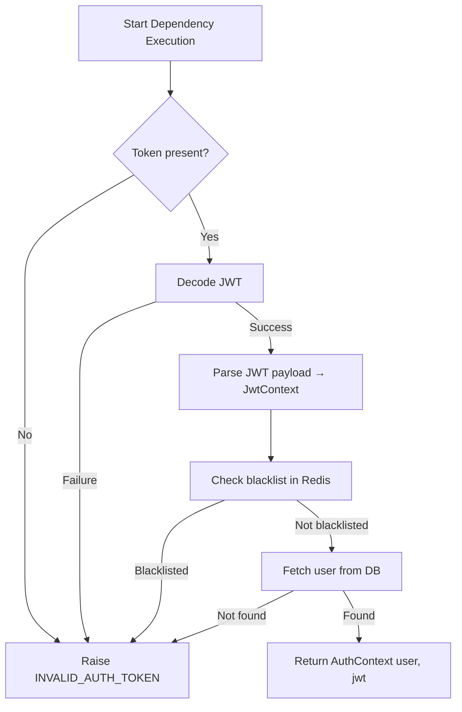

# Flow: Auth Guard (JWT Validation & User Context)

**Endpoint:** Used as dependency
**Summary:** Validates JWT access token, checks blacklist status, fetches the user, and returns an authentication context.

## 1. Inputs & Dependencies

| Name    | Type                | Description                                  |
| ------- | ------------------- | -------------------------------------------- |
| `token` | OAuth2 Bearer Token | JWT access token from `Authorization` header |
| `db`    | Session             | Database connection                          |
| `redis` | Redis client        | Used for token blacklist lookup              |

## 2. Linear Logic (Code Flow)

1. **Check token presence**
   - If token is `None` → raise `INVALID_AUTH_TOKEN`.

2. **Decode JWT**
   - Decode token using secret key and algorithm.
   - If decoding fails → raise `INVALID_AUTH_TOKEN`.

3. **Parse JWT payload**
   - Build `JwtContext` from decoded payload.
   - Extract `sub`, `jti`, `exp`.

4. **Blacklist validation**
   - Check Redis key: `BLACKLIST_PREFIX + jti`.
   - If exists → token is revoked → raise `INVALID_AUTH_TOKEN`.

5. **Fetch user**
   - Query user by `sub` (user id).
   - If not found → raise `INVALID_AUTH_TOKEN`.

6. **Build AuthContext**
   - Return `AuthContext(user, jwt_context)`.

## 3. Logic Flow

## 4. Failure Conditions

| Condition         | Result               |
| ----------------- | -------------------- |
| Missing token     | `INVALID_AUTH_TOKEN` |
| Invalid JWT       | `INVALID_AUTH_TOKEN` |
| Blacklisted token | `INVALID_AUTH_TOKEN` |
| User not found    | `INVALID_AUTH_TOKEN` |

## 5. Output

| Type          | Description                                                    |
| ------------- | -------------------------------------------------------------- |
| `AuthContext` | Contains authenticated `User` and `JwtContext` (jti, sub, exp) |
