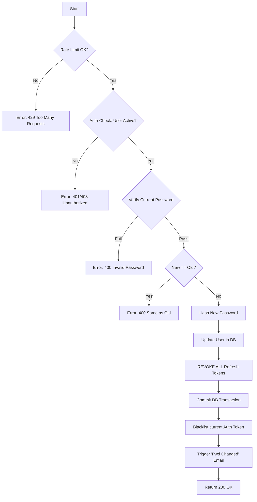

# Flow: Change Password

**Endpoint:** `POST /api/v1/auth/change-password`
**Summary:** Allows an authenticated user to change their password. This action requires verification of the current password and **revokes all active sessions** (refresh tokens) to ensure security.

---

## 1. Inputs & Dependencies

| Name           | Type                 | Description                                                    |
| -------------- | -------------------- | -------------------------------------------------------------- |
| `body`         | PasswordChangeSchema | JSON payload containing `current_password` and `new_password`. |
| `auth_cxt`     | Auth Dependency      | The jwt context containing user (extracted from Access Token). |
| `db`           | Session              | Database connection.                                           |
| `rate_limiter` | Dependency           | Rate limiter to prevent brute-forcing the current password.    |

---

## 2. Linear Logic (Code Flow)

1. **Rate limit check**
   - Check limits (e.g., 5 attempts per minute) to prevent brute-force attacks on the `current_password`.
   - If exceeded → **RAISE** `429 Too Many Requests`.

2. **Authentication check (Implicit)**
   - _Dependency:_ Ensure `current_user` is present and `ACTIVE`.
   - If missing/inactive → **RAISE** `401 Unauthorized` or `403 Forbidden`.

3. **Verify current password**
   - Call `verify_password(body.current_password, current_user.password)`.
   - If invalid → **RAISE** `400 Bad Request` (Code: `INVALID_CURRENT_PASSWORD`).
   - _Note: Using 400 instead of 401 helps distinguish "bad token" (401) from "bad input" (400)._

4. **Validate new password logic**
   - Check if `new_password` is the same as `current_password`.
   - If same → **RAISE** `400 Bad Request` (Code: `PASSWORD_SAME_AS_OLD`).
   - _Note: Complexity checks (length, special chars) are handled by Pydantic validation before this step._

5. **Hash new password**
   - Generate salt and hash: `new_hash = get_password_hash(body.new_password)`.

6. **Update user record**
   - Set `current_user.password = new_hash`.

7. **Security: Global Session Revocation**
   - **CRITICAL STEP:** Delete **ALL** rows in the `refresh_tokens` table associated with `current_user.id`.
   - _Why?_ If the user is changing their password because they suspect a breach, this immediately kicks attackers off other devices.

8. **Security: Blacklist Current JWT**
   - Add the current Access Token's jti (unique ID) to Redis with a TTL equal to the token's remaining life.
   - Effect: Immediately invalidates the current session, forcing the client to re-login to get a new token generated with the new password hash.

9. **Commit transaction**
   - Save changes to DB.

10. **Trigger notification (Async)**
    - Enqueue background task: `send_password_changed_notification_email.delay(user.email)`.

11. **Return response**
    - **200 OK**
    - Body: `{"message": "Password updated successfully. Please login again."}`

---

## 3. Security & Session Rules

| Scenario             | Action                                                                                                     |
| -------------------- | ---------------------------------------------------------------------------------------------------------- |
| **Password Changed** | **Hard Revocation:** All existing Refresh Tokens for this user are deleted immediately.                    |
| **Current Session**  | The current Access Token remains valid until its short expiry (e.g., 15 mins), but it cannot be refreshed. |
| **Other Devices**    | Will be forced to log out when their Access Token expires, as their Refresh Token is now invalid.          |

---

## 4. Logic Flow

---

## 5. Response Codes

| Code    | Reason                                                            |
| ------- | ----------------------------------------------------------------- |
| **200** | Password successfully updated.                                    |
| **400** | `current_password` is incorrect OR `new_password` violates rules. |
| **401** | User is not logged in (Missing/Invalid Access Token).             |
| **429** | Too many password change attempts.                                |
