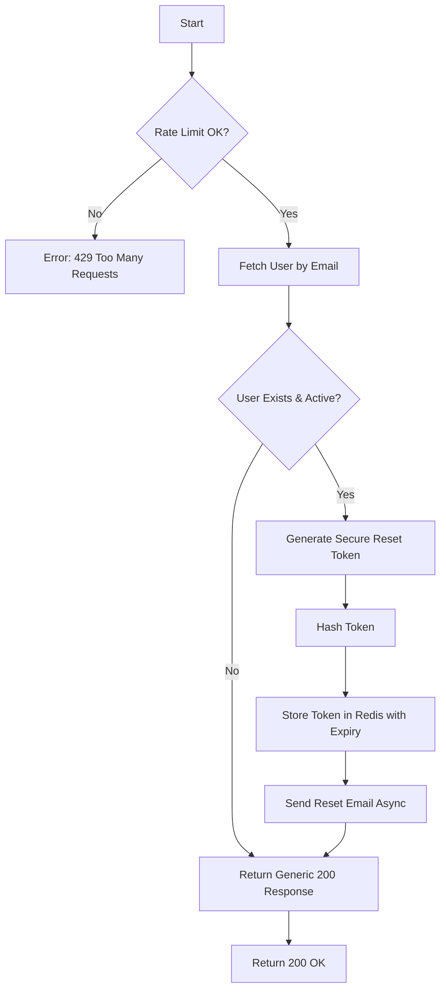

# Flow: Forgot Password (Request Reset Link)

**Endpoint:** `POST /api/v1/auth/forgot-password`
**Summary:** Accepts a user email and, if the account exists, generates a short-lived one-time reset token and sends a password reset link via email. Always returns a generic success response to prevent account enumeration.

---

## 1. Inputs & Dependencies

| Name      | Type       | Description                                                     |
| --------- | ---------- | --------------------------------------------------------------- |
| `payload` | JSON Body  | Contains `email`.                                               |
| `db`      | Session    | Database connection.                                            |

---

## 2. Linear Logic (Code Flow)

1. **Rate limit check**

   * Rate limit per IP.
   * Rate limit per email.
   * If exceeded → **RAISE** `429 Too Many Requests`.

2. **Query user**

   * Fetch user where `email == payload.email`.

3. **Always return generic response**

   * Never reveal whether user exists.

4. **IF user exists AND user.status == ACTIVE**

   4.1 Generate secure random reset token.
   4.2 Store record in `password_reset_tokens` redis key:value pair:

   * `user_id`
   * `issued_at`

   ```text
   https://yourdomain.com/reset-password?token=<token>
   ```

5. **Send email asynchronously**

6. **Return response**

   * **200 OK**
   * Body:

   ```json
   { "message": "If the account exists, a reset link has been sent." }
   ```

---

## 3. Logic Flow



---

## 4. Security Rules

| Scenario             | Action                                                                   |
| -------------------- | ------------------------------------------------------------------------ |
| Email does not exist | Still return 200 (no enumeration).                                       |
| Account inactive     | Do NOT send reset email.                                                 |
| Too many requests    | Return 429.                                                              |
| Multiple requests    | Allow but generate new token (optionally revoke previous unused tokens). |
| Token expires        | Reset requires new request.                                              |
| Token used once      | Mark as used, cannot be reused.                                          |

---

## 5. Response Codes

| Code    | Reason                                         |
| ------- | ---------------------------------------------- |
| **200** | Generic response (email may or may not exist). |
| **429** | Rate limit exceeded.                           |

---
