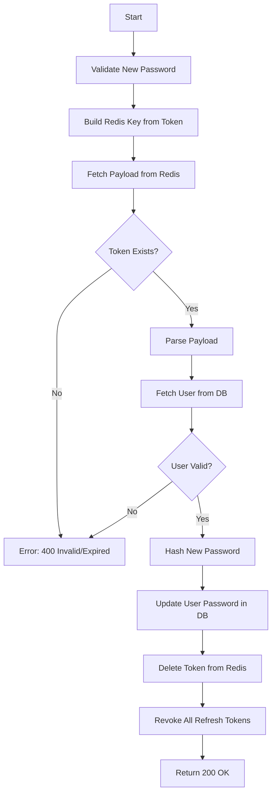

# Flow: Reset Password (Using Token)

**Endpoint:** `POST /api/v1/auth/reset-password`
**Summary:** Validates a password reset token stored in Redis and updates the user password. Token is one-time use and expires automatically via Redis TTL.

---

## 1. Inputs & Dependencies

| Name       | Type             | Description                               |
| ---------- | ---------------- | ----------------------------------------- |
| `request`  | Request context  | Need for revoking refresh tokens.         |
| `response` | Response context | Need for deleting refresh tokens cookies. |
| `payload`  | JSON Body        | Contains `token`, `new_password`.         |
| `db`       | Session          | Database connection (for user update).    |

---

## 2. Linear Logic (Code Flow)

1. **Validate new password**
   - Enforce complexity.
   - Must not equal old password.
   - If invalid → **RAISE** `400 Bad Request`.

2. **Build Redis key**

   ```python
   key = PASSWORD_RESET_PREFIX + token
   ```

3. **Fetch token payload from Redis**
   - `stored_data = redis.get(key)`

4. **IF token not found**
   - Token expired or invalid.
   - **RAISE** `400 Invalid or expired token`.

5. **Parse payload**
   - Extract:
     - `user_id`
     - `issued_at`

6. **Fetch user from database**
   - Query by `user_id`.
   - If user does not exist or inactive → **RAISE** `400 Invalid or expired token`.

7. **Update password**
   - Hash new password.
   - Save to DB.

8. **Delete token from Redis**
   - `redis.delete(key)`
   - Ensures one-time usage.

9. **Revoke all refresh tokens for user**
   - Delete refresh tokens from DB.
   - Or increment token version.
   - Forces logout everywhere.

10. **Return success**

- **200 OK**

```json
{ "message": "Password reset successful." }
```

---

## 3. Logic Flow (Redis Version)



---

## 5. Response Codes

| Code    | Reason                                   |
| ------- | ---------------------------------------- |
| **200** | Password reset successful.               |
| **400** | Invalid, expired, or already used token. |
| **429** | (Optional) Rate limit exceeded.          |

---
