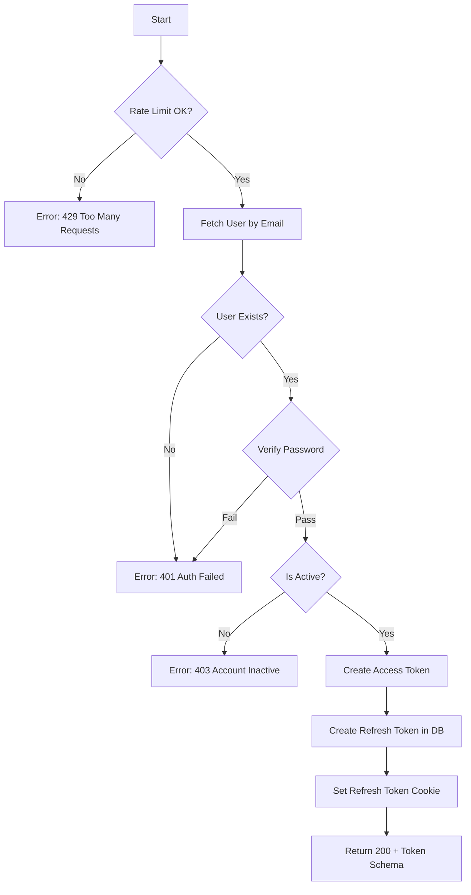

# Flow: Login

**Endpoint:** `POST /api/v1/auth/token`
**Summary:** Authenticates user via Username/Password, issues a short-lived JWT access token and a long-lived refresh token stored in an HttpOnly cookie.

---

## 1. Inputs & Dependencies

| Name        | Type      | Description                                                   |
| ----------- | --------- | ------------------------------------------------------------- |
| `form_data` | OAuthForm | Contains `username` and `password`.                           |
| `db`        | Session   | Database connection.                                          |
| `request`   | Request   | Used to capture IP and User-Agent for refresh token metadata. |
| `response`  | Response  | Used to set refresh token cookie.                             |

---

## 2. Linear Logic (Code Flow)

1. **Rate limit check**

   * If exceeded → **RAISE** `429 Too Many Requests`.

2. **Get user**

   * Query DB for user where `email == form_data.username`.

3. **IF user does not exist**

   * **RAISE** `401 Unauthorized` (Code: `AUTH_FAILED`).

4. **Verify password**

   * Call `verify_password(form_data.password, user.password)`.
   * If invalid → **RAISE** `401 Unauthorized` (Code: `AUTH_FAILED`).

5. **Check user status**

   * If `user.status != ACTIVE` → **RAISE** `403 Forbidden` (Code: `ACCOUNT_INACTIVE`).

6. **Create JWT access token**

   * Generate JWT using `user.id` as `sub`.

7. **Create refresh token (DB + rotation support)**

   * Generate secure random token (plaintext + hash).
   * Store hashed token in `refresh_tokens` table with:

     * `user_id`
     * `expires_at`
     * `user_agent`
     * `ip_address`

8. **Set refresh token cookie**

   * Set cookie:

     * `key = refresh_token`
     * `value = plaintext_refresh_token`
     * `HttpOnly = True`
     * `Secure = True (prod)`
     * `SameSite = strict`
     * `Path = /api/v1/auth/`
     * `Max-Age = REFRESH_TOKEN_EXPIRE_SECONDS`

9. **Return response**

   * **200 OK**
   * Body: `TokenSchema { access_token, token_type="bearer" }`

---

## 3. Token Re-issuance & Rotation Rules

| Scenario                        | Action                                           |
| ------------------------------- | ------------------------------------------------ |
| User logs in                    | Issue **new refresh token**                      |
| Access token expires            | Client uses refresh token                        |
| Refresh token used              | Old refresh token is **revoked**, new one issued |
| Revoked refresh token reused    | **All tokens revoked**, force re-login           |
| Refresh token expired           | Force re-login                                   |
| Password change / user disabled | Revoke all refresh tokens                        |

---

## 4. Logic Flow

---

## 5. Response Codes

| Code    | Reason                                                  |
| ------- | ------------------------------------------------------- |
| **200** | Successful login (access token + refresh token issued). |
| **401** | User not found or password incorrect.                   |
| **403** | User account inactive.                                  |
| **429** | Rate limit exceeded.                                    |

---
