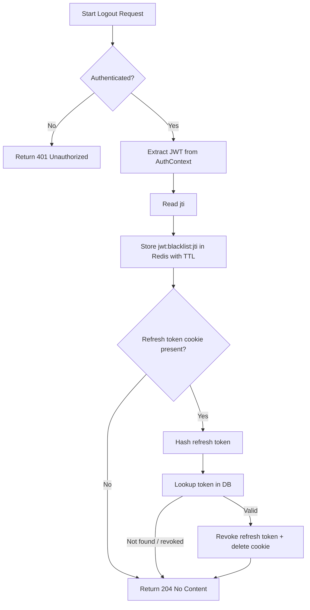

# Flow: Logout

**Endpoint:** `POST /api/v1/auth/logout`
**Summary:** Logs out an authenticated user by blacklisting the access token and revoking the refresh token (if present).

---

## 1. Inputs & Dependencies

| Name                   | Type            | Description                                      |
| ---------------------- | --------------- | ------------------------------------------------ |
| `Authorization`        | Header (Bearer) | Access token (JWT).                              |
| `refresh_token`        | HttpOnly Cookie | Optional refresh token to revoke.                |
| `auth_guard`           | Dependency      | Authenticates user and builds `AuthContext`.     |
| `CompositeRateLimiter` | Dependency      | Prevents logout abuse (20 requests/min/IP+user). |
| `db`                   | Session         | Database connection.                             |

---

## 2. Linear Logic (Code Flow)

1. **Authenticate request**

   * `auth_guard` validates JWT.
   * Builds `AuthContext(user, jwt)`.

2. **Blacklist access token**

   * Extract `jti` from JWT.
   * Store key:

     ```python
     jwt:blacklist:{jti}
     ```

   * TTL = remaining lifetime of JWT.

3. **Handle refresh token (optional)**

   * If `refresh_token` cookie exists:

     1. Hash token.
     2. Fetch token from DB.
     3. If found and not revoked:

        * Revoke token:

          * set `revoked_at`
          * set reason = `user_logout`
          * clear refresh cookie.

4. **Return response**

   * HTTP **204 No Content**

---

## 3. Token Revocation Rules

| Token Type            | Action                                |
| --------------------- | ------------------------------------- |
| Access Token (JWT)    | Blacklisted in Redis until expiration |
| Refresh Token         | Revoked in DB + cookie cleared        |
| Missing refresh token | Access token still blacklisted        |

---

## 4. Logic Flow



---

## 5. Failure Conditions

| Condition             | Result                      |
| --------------------- | --------------------------- |
| Missing / invalid JWT | `401 Unauthorized`          |
| Rate limit exceeded   | `429 Too Many Requests`     |
| DB failure            | `500 Internal Server Error` |

---

## 6. Response Codes

| Code    | Meaning                           |
| ------- | --------------------------------- |
| **204** | Logout successful                 |
| **401** | Not authenticated / invalid token |
| **429** | Too many logout attempts          |

---
