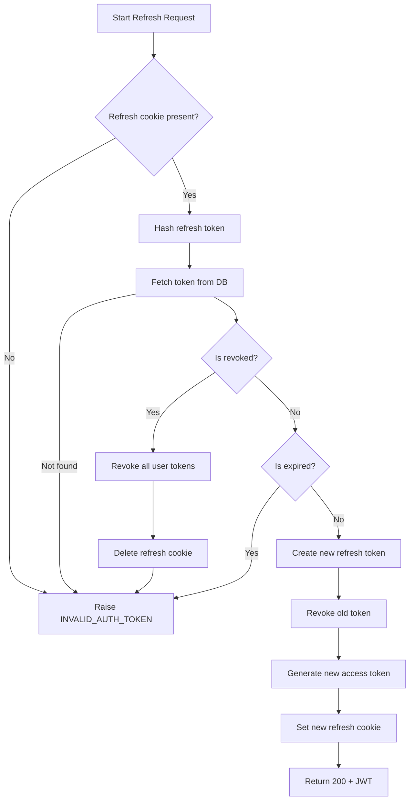

# Flow: Refresh Access Token (JWT Rotation with Refresh Token)

**Endpoint:** `POST /api/v1/auth/token/refresh`
**Summary:** Validates a refresh token stored in an HttpOnly cookie, rotates it securely, revokes the old token, issues a new refresh token and a new short-lived JWT access token.

---

## 1. Inputs & Dependencies

| Name            | Type                    | Description                      |
| --------------- | ----------------------- | -------------------------------- |
| `refresh_token` | HttpOnly Cookie (`str`) | Refresh token provided by client |
| `request`       | Request                 | Used to capture IP & User-Agent  |
| `response`      | Response                | Used to set/delete cookies       |
| `db`            | Session                 | Database connection              |

---

## 2. Linear Logic (Code Flow)

1. **Check refresh token presence**
   - If cookie is missing → raise `INVALID_AUTH_TOKEN`.

2. **Hash refresh token**
   - Convert plaintext token into secure hash.

3. **Fetch token from database**
   - Lookup token by hash.
   - If not found → raise `INVALID_AUTH_TOKEN`.

4. **Check if token is revoked**
   - If revoked:
     - Revoke **all active refresh tokens** for the user.
     - Clear refresh cookie.
     - Raise `INVALID_AUTH_TOKEN`.

5. **Check if token is expired**
   - If expired → raise `INVALID_AUTH_TOKEN`.

6. **Rotate token (atomic transaction)**
   - Create new refresh token (store hashed version).
   - Revoke old token:
     - Set `revoked_at`
     - Store replacement token hash
     - Store IP & User-Agent

7. **Generate new access token**
   - Create new JWT using user id.

8. **Set new refresh token cookie**
   - HttpOnly, Secure (prod), SameSite strict.

9. **Return response**
   - `200 OK` with new JWT access token.

---

## 3. Refresh Token Re-issuance Rules

A **new refresh token is generated only in these cases:**

| Scenario                      | Action                              |
| ----------------------------- | ----------------------------------- |
| User logs in with credentials | Create refresh token                |
| Valid refresh token is used   | Rotate token                        |
| Refresh token expired         | Require re-login                    |
| Refresh token revoked         | Revoke all tokens, require re-login |
| Suspicious reuse detected     | Revoke all tokens                   |

> Only **valid & active refresh tokens** are eligible for rotation.

---

## 4. Logic Flow

---

## 5. Failure Conditions

| Condition       | Result                            |
| --------------- | --------------------------------- |
| Missing cookie  | `INVALID_AUTH_TOKEN`              |
| Token not found | `INVALID_AUTH_TOKEN`              |
| Token revoked   | Revoke all + `INVALID_AUTH_TOKEN` |
| Token expired   | `INVALID_AUTH_TOKEN`              |

---

## 6. Output

| Type    | Description                    |
| ------- | ------------------------------ |
| `Token` | `{ access_token, token_type }` |

---

## 7. Security Properties

- Refresh tokens are:
  - Stored **hashed** in DB
  - Stored in **HttpOnly cookies**
  - Rotated on every use
  - Revoked on reuse detection
  - Tracked by IP & User-Agent

- Access tokens:
  - Short-lived
  - Stateless
  - Blacklisted on logout
