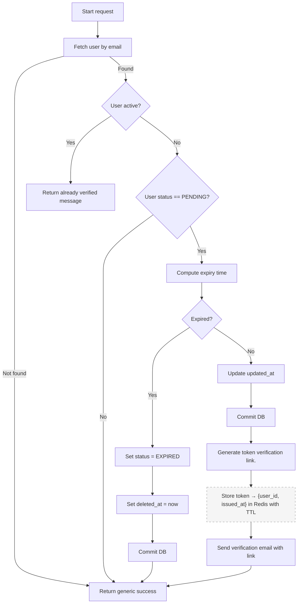

# Flow: Resend Verification Email

**Endpoint:** `POST /api/v1/auth/resend-verification`
**Summary:** Resends the email verification link for an unverified user account without revealing whether the account exists.

## 1. Inputs & Dependencies

| Name    | Type                   | Description                                             |
| :------ | :--------------------- | :------------------------------------------------------ |
| `email` | JSON Body (`EmailStr`) | Email address for which verification link is requested. |
| `db`    | Session                | Database connection.                                    |

## 2. Linear Logic (Code Flow)

1. **Fetch user by email**

   * Query user where `email = input_email` and `deleted_at IS NULL`.

2. **User does not exist**

   * Return generic success message.

3. **User already verified**

   * If `user.status == active` → return message: account already verified.

4. **Validate account state**

   * If `user.status != PENDING` (for example: EXPIRED, DELETED, etc.) → return generic success message.

5. **Check account expiry window**

   * Compute `expiry_time = user.updated_at + grace_period`.
   * If `now > expiry_time`:

     * Set `deleted_at = now`.
     * Commit DB.
     * Return generic success message.

6. **Start new verification window**

   * Set `user.updated_at = now`.
   * Commit DB.

7. **Generate verification token**

   * Generate secure random token.
   * Store in Redis as:

     * `token → { user_id, issued_at }`
     * TTL = `expiry_time - now` in seconds.

8. **Send verification email**

   * Enqueue background task with email and verification link.

9. **Return response**

   * Return generic success message.

## 3. Logic flow

## 4. Response Codes

| Code    | Reason                                               |
| :------ | :--------------------------------------------------- |
| **200** | Verification email sent or account already verified. |
| **400** | Invalid request data.                                |
| **429** | Too many requests (rate limited).                    |
| **500** | Internal server error.                               |
