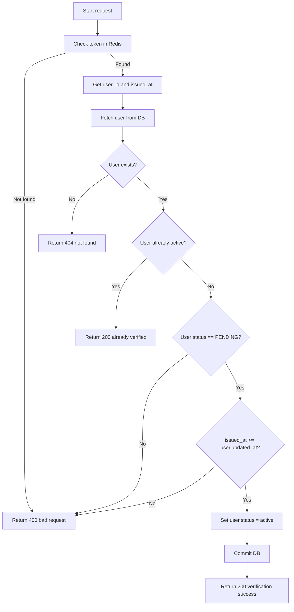

# Flow: Email verification

**Endpoint:** `GEt /auth/verify/{token}`
**Summary:** Verifies the user email by activation token.

## 1. Inputs & Dependencies

| Name | Type | Description |
| :--- | :--- | :--- |
| `token` | Url token | A unique token string to verify the user's email. |
| `db` | Session | Database Connection. |

## 2. Linear Logic (Code Flow)

1. **Verify token in Redis**

   * Check if the token exists in Redis.
   * If valid → retrieve `user_id` and `issued_at`.
   * If not valid → set result to `None`.

2. **Handle invalid token**

   * If result is `None` → raise `400 Bad Request`.

3. **Fetch user**

   * Query database using `user_id`.

4. **Validate user**

   * If user not found → raise `404 Not Found`.
   * If user `status == active` → return `200 OK` with “already verified” message.
   * If user `status != pending` → return `400 Bad Request` (it's already expired or deleted).

5. **Validate token freshness**

   * Compare:

     ```python
     issued_at >= user.updated_at
     ```

   * If false → token is from an old resend request → raise `400 Bad Request`.

6. **Activate user**

   * Set `user.status = active`.
   * Commit changes to database.

7. **Return success**

   * Return `200 OK` with verification success message.

## Logic Flow



## 4. Response Codes

| Code | Reason |
| :--- | :--- |
| 204 | Logout successful |
| 404 | User not found |
| 400 | Verification Token expired |
| 401 | Unauthorized (not authenticated) |
