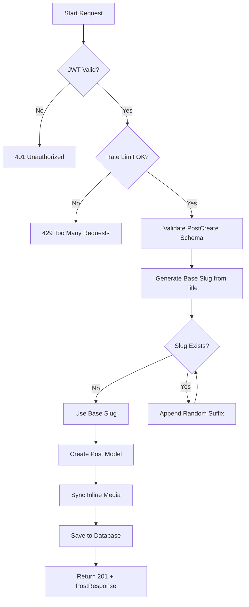

# Flow: Create Post

**Endpoint:** `POST /api/v1/posts/`
**Summary:** Creates a new post for the authenticated user, generates a unique SEO-friendly slug, and persists the post in the database.

---

## 1. Inputs & Dependencies

| Name        | Type            | Description                                                        |
| ----------- | --------------- | ------------------------------------------------------------------ |
| `post_in`   | `PostCreate`    | Request body containing post data (title, content, summary, etc.). |
| `auth_cxt`  | `AuthContext`   | Authenticated user context (JWT validated).                        |
| `db`        | `AsyncSession`  | Database session dependency.                                       |
| `rate_limit`| `RateLimitDep`  | Rate limiter (10 requests per 60 minutes).                         |

---

## 2. Linear Logic (Code Flow)

1. **Authentication guard**

   * Validate JWT access token.
   * If invalid or missing → **RAISE** `401 Unauthorized`.

2. **Rate limit check**

   * Apply composite rate limiter (per IP + per user).
   * If exceeded → **RAISE** `429 Too Many Requests`.

3. **Parse request body**

   * Validate request against `PostCreate` schema.
   * If invalid → **RAISE** `422 Validation Error`.

4. **Generate base slug**

   * Convert `title` → URL-safe slug using `slugify(title)`.
   * If slug is empty → fallback to `"post"`.

5. **Check slug uniqueness**

   * Query database for existing post with same slug.

6. **If slug already exists**

   * Generate new candidate slug:
     `"{base_slug}-{random_8_char_uuid}"`.
   * Repeat check until unique slug is found.

7. **Create Post model**

8. **Sync inline media**

   * Call `PostService.sync_post_media`.
   * Extract image blocks from `content`.
   * Create `MediaUsage` records for inline images.
   * Mark used `Media` records as `ACTIVE`.

9. **Commit to DB**

10. **Return response**

   * **201 Created**
   * Body: `PostResponse` schema.

---

## 4. Logic Flow

---

## 5. Response Codes

| Code    | Reason                                   |
| ------- | ---------------------------------------- |
| **201** | Post created successfully.               |
| **401** | Invalid or missing authentication token. |
| **422** | Invalid request payload.                 |
| **429** | Rate limit exceeded.                     |

---
