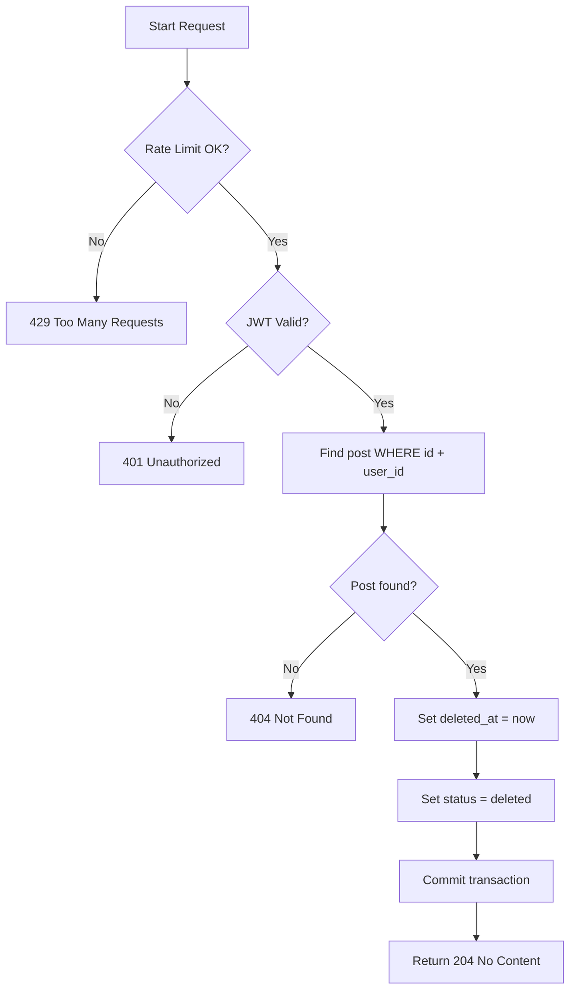

# Flow: Soft Delete Post (By ID)

**Endpoint:** `DELETE /api/v1/posts/{id}`
**Summary:** Soft deletes a post owned by the authenticated user using its unique ID. The operation is rate-limited and marks the post as deleted without permanently removing it from the database.

---

## 1. Inputs & Dependencies

| Name        | Type           | Description                                            |
| ----------- | -------------- | ------------------------------------------------------ |
| `id`        | `str`          | Unique ID identifying the post to soft delete (path).  |
| `db`        | `AsyncSession` | Database session dependency.                           |
| `auth_cxt`  | `AuthContext`  | Authenticated user context (JWT validated).            |
| `rate_limit`| `RateLimitDep` | Rate limiter (5 requests per 1 minute).                |

---

## 2. Linear Logic (Code Flow)

1. **Rate limit check**

   * Apply rate limiter: `limit=5`, `window=60s`.
   * If exceeded → **RAISE** `429 Too Many Requests`.

2. **Authentication guard**

   * Validate JWT access token.
   * If invalid/missing → **RAISE** `401 Unauthorized`.

3. **Soft delete post**

   * Execute soft delete operation:

     * Find post by `id` WHERE `user_id = current_user.id`
     * Set `deleted_at = now()` (timestamp-based soft delete)
     * Set `status` = `deleted`
     * Persist changes to database

4. **Check soft delete result**

   * If no post found:
     * Post does not exist OR does not belong to user
     * → **RAISE** `404 Not Found`

5. **Commit transaction**

   * Persist soft delete with database commit.

6. **Return response**

   * **204 No Content**
   * Empty body
   * Post remains in database with `deleted_at` timestamp

---

## 3. Logic Flow

---

## 4. Response Codes

| Code    | Reason                                           |
| ------- | ------------------------------------------------ |
| **204** | Post successfully soft deleted (marked deleted). |
| **401** | Invalid or missing authentication token.         |
| **404** | Post not found or not owned by user.             |
| **429** | Rate limit exceeded.                             |

---
