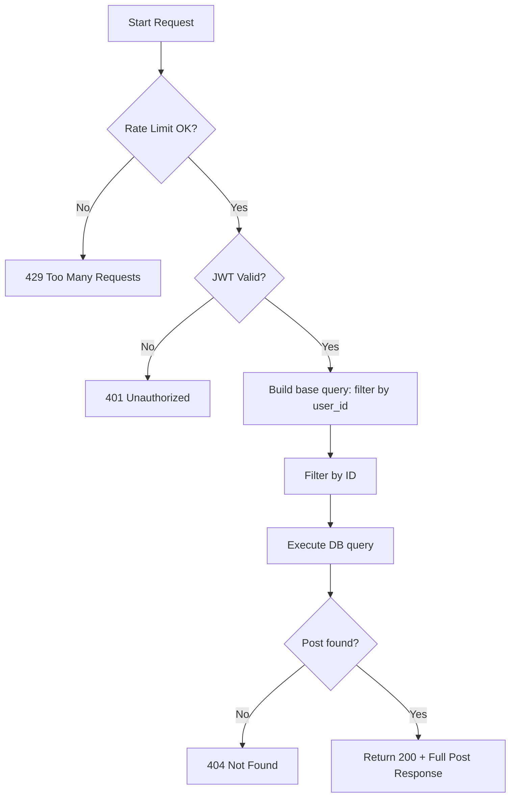

# Flow: Get Post Detail (By ID)

**Endpoint:** `GET /api/v1/posts/{id}`
**Summary:** Returns the full details of a single post (including Editor.js JSON content) owned by the authenticated user, identified by its unique ID.

---

## 1. Inputs & Dependencies

| Name        | Type           | Description                                  |
| ----------- | -------------- | -------------------------------------------- |
| `id`        | `str`          | The unique ID of the post (path param).      |
| `auth_cxt`  | `AuthContext`  | Authenticated user context (JWT validated).  |
| `db`        | `AsyncSession` | Database session dependency.                 |
| `rate_limit`| `RateLimitDep` | Rate limiter (60 requests per 1 minute).     |

---

## 2. Linear Logic (Code Flow)

1. **Rate limit check**

   * Apply composite limiter: `limit=60`, `window=60s`.
   * If exceeded → **RAISE** `429 Too Many Requests`.

2. **Authentication guard**

   * Validate JWT access token.
   * If invalid/missing → **RAISE** `401 Unauthorized`.

3. **Validate identifier**

   * Ensure `id` is provided.

4. **Build base query**

   * Filter posts by:

     * `user_id == current_user.id`

5. **Apply ID filter**

   * Filter by:

     * `id == provided ID`

6. **Execute query**

7. **Handle not found**

   * If no post → **RAISE** `404 Not Found`.

8. **Return response**

   * **200 OK**
   * Body: `PostResponse` (full detail including JSON content)

---

## 3. Logic Flow

---

## 4. Response Codes

| Code    | Reason                                   |
| ------- | ---------------------------------------- |
| **200** | Post successfully retrieved.             |
| **401** | Invalid or missing authentication token. |
| **404** | Post not found.                          |
| **429** | Rate limit exceeded.                     |

---
