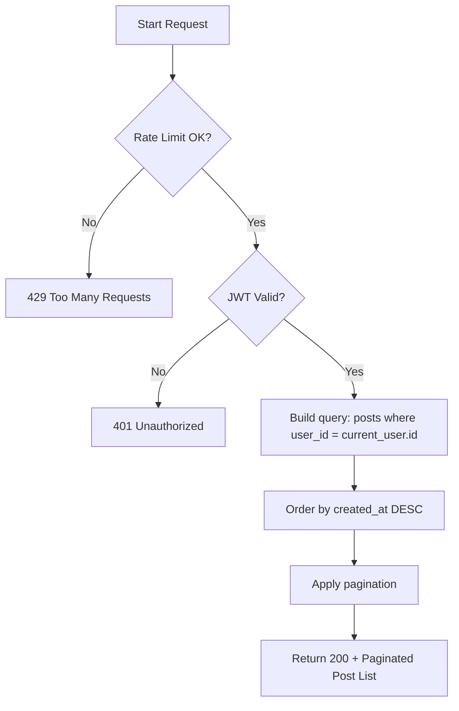

# Flow: Get All Posts (List View)

**Endpoint:** `GET /api/v1/posts`
**Summary:** Returns a paginated list of posts owned by the authenticated user, excluding full JSON content (lightweight list view).

---

## 1. Inputs & Dependencies

| Name        | Type           | Description                                                |
| ----------- | -------------- | ---------------------------------------------------------- |
| `auth_cxt`  | `AuthContext`  | Authenticated user context (JWT validated).                |
| `db`        | `AsyncSession` | Database session dependency.                               |
| `rate_limit`| `RateLimitDep` | Rate limiter (60 requests per 1 minute).                   |

---

## 2. Linear Logic (Code Flow)

1. **Rate limit check**

   * Apply composite limiter: `limit=60`, `window=60s`.
   * If exceeded → **RAISE** `429 Too Many Requests`.

2. **Authentication guard**

   * Validate JWT access token.
   * If invalid/missing → **RAISE** `401 Unauthorized`.

3. **Build query**

   * Select posts where:

     * `user_id == current_user.id`

   * Order by:

     * `created_at DESC`

4. **Paginate**

   * Apply limit-offset pagination.

5. **Return response**

   * **200 OK**
   * Body: `LimitOffsetPage[PostListResponse]`

---

## 3. Security & Data Scope Rules

| Rule                | Behavior                        |
| ------------------- | ------------------------------- |
| Ownership enforced  | Users only see their own posts  |
| No full content     | Editor.js JSON content excluded |
| Rate limited        | 60 requests/min per user + IP   |
| Pagination enforced | Prevents large dataset abuse    |

---

## 4. Logic Flow

---

## 5. Response Codes

| Code    | Reason                                   |
| ------- | ---------------------------------------- |
| **200** | Posts successfully retrieved.            |
| **401** | Invalid or missing authentication token. |
| **429** | Rate limit exceeded.                     |

---
