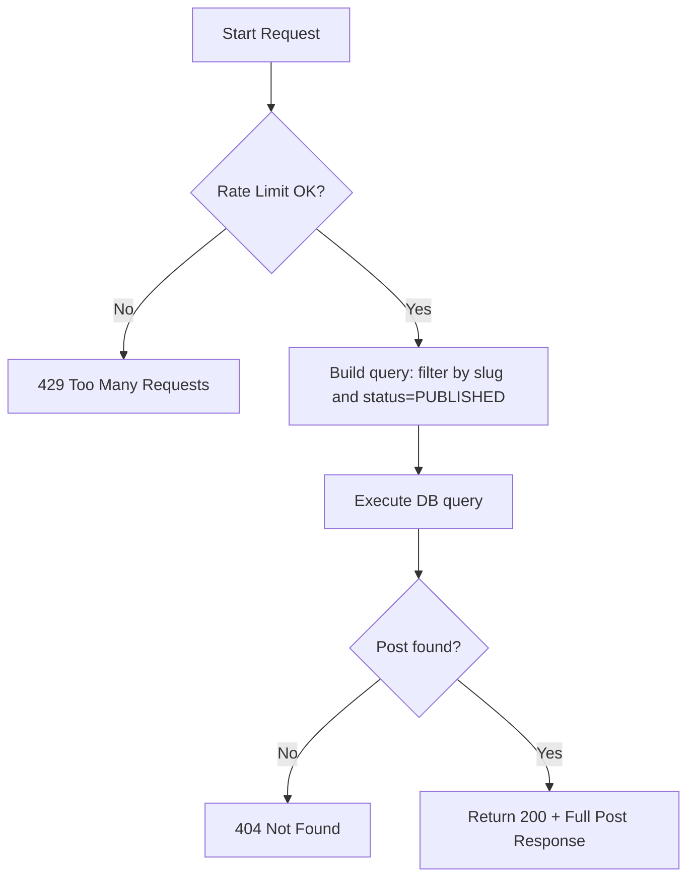

# Flow: Get Public Post Detail (By Slug)

**Endpoint:** `GET /api/v1/posts/public/{slug}`
**Summary:** Returns the full details of a single published post identified by its URL slug. No authentication required.

---

## 1. Inputs & Dependencies

| Name        | Type           | Description                                  |
| ----------- | -------------- | -------------------------------------------- |
| `slug`      | `str`          | The unique URL slug of the post (path param).|
| `db`        | `AsyncSession` | Database session dependency.                 |
| `rate_limit`| `RateLimitDep` | Rate limiter (60 requests per 1 minute).     |

---

## 2. Linear Logic (Code Flow)

1. **Rate limit check**

   * Apply composite limiter: `limit=60`, `window=60s`.
   * If exceeded → **RAISE** `429 Too Many Requests`.

2. **Build query**

   * Filter posts by:

     * `slug == provided slug`
     * `status == PostStatus.PUBLISHED`

3. **Execute query**

4. **Handle not found**

   * If no post → **RAISE** `404 Not Found`.

5. **Return response**

   * **200 OK**
   * Body: `PostResponse` (full detail including JSON content)

---

## 3. Logic Flow

---

## 4. Response Codes

| Code    | Reason                                   |
| ------- | ---------------------------------------- |
| **200** | Post successfully retrieved.             |
| **404** | Post not found or not published.         |
| **429** | Rate limit exceeded.                     |

---
