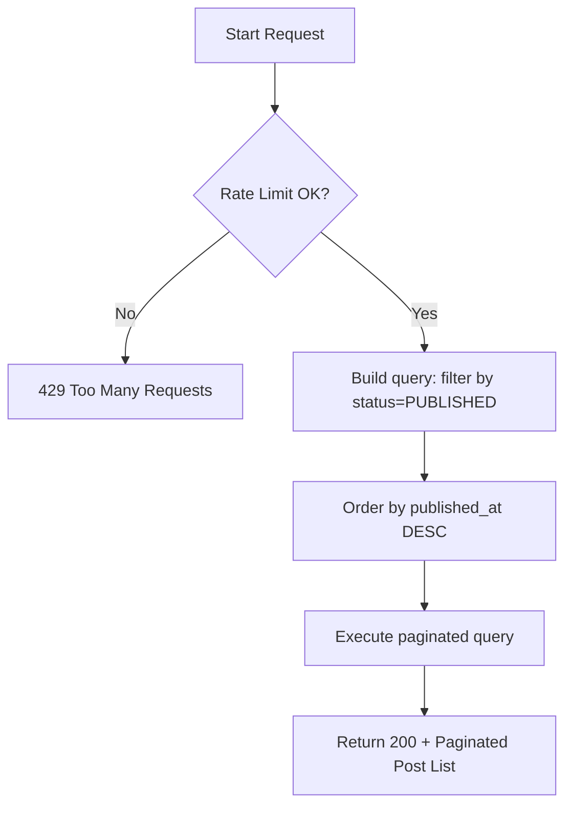

# Flow: Get Public Posts (Published Only)

**Endpoint:** `GET /api/v1/posts/public/`
**Summary:** Returns a paginated list of all published posts (Lightweight List view) without requiring authentication.

---

## 1. Inputs & Dependencies

| Name        | Type           | Description                                  |
| ----------- | -------------- | -------------------------------------------- |
| `db`        | `AsyncSession` | Database session dependency.                 |
| `rate_limit`| `RateLimitDep` | Rate limiter (60 requests per 1 minute).     |

---

## 2. Linear Logic (Code Flow)

1. **Rate limit check**

   * Apply composite limiter: `limit=60`, `window=60s`.
   * If exceeded → **RAISE** `429 Too Many Requests`.

2. **Build query**

   * Filter posts by:

     * `status == PostStatus.PUBLISHED`

3. **Apply ordering**

   * Order by `published_at DESC`.

4. **Execute paginated query**

5. **Return response**

   * **200 OK**
   * Body: `LimitOffsetPage[PostListResponse]` (lightweight view)

---

## 3. Logic Flow

---

## 4. Response Codes

| Code    | Reason                                   |
| ------- | ---------------------------------------- |
| **200** | Posts successfully retrieved.            |
| **429** | Rate limit exceeded.                     |

---
