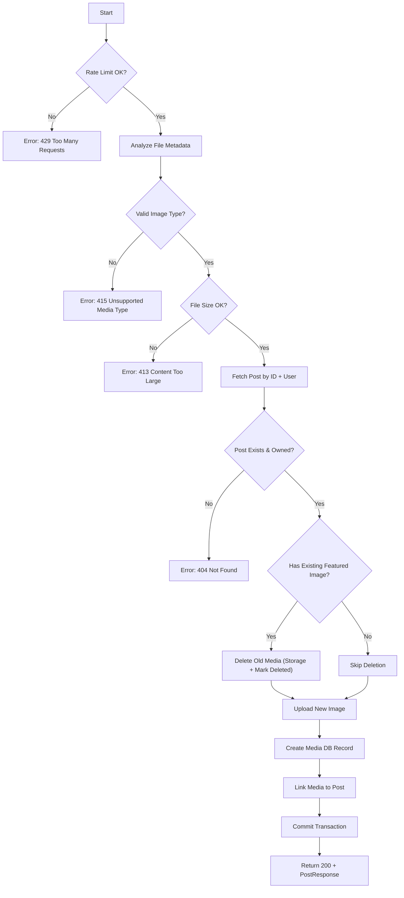

# Flow: Update Post Featured Image

**Endpoint:** `PUT /api/v1/posts/{id}/featured-image`
**Summary:** Uploads and replaces the authenticated user’s post featured image using its unique ID. Validates file integrity and type, deletes previous featured image (if any), stores new file via storage backend using the post ID as a stable directory, and updates the post-media relationship.

---

## 1. Inputs & Dependencies

| Name            | Type           | Description                                                                                               |
| --------------- | -------------- | --------------------------------------------------------------------------------------------------------- |
| `id`            | `str`          | Unique ID identifying the post.                                                                           |
| `analyzed_file` | `AnalyzedFile` | Dependency that inspects magic bytes, calculates real size, normalizes extension, and resets file cursor. |
| `auth_cxt`      | `AuthContext`  | Injected authenticated user via `auth_guard`.                                                             |
| `db`            | `AsyncSession` | Database session.                                                                                         |
| `_`             | `RateLimitDep` | Rate limit (5 requests per minute).                                                                       |

---

## 2. Linear Logic (Code Flow)

1. **Rate limit check**
   - If exceeded → **RAISE** `429 Too Many Requests`.

2. **File metadata analysis (automatic via dependency)**
   - Calculate real file size.
   - Detect real MIME type using magic numbers (ignores client header).
   - Normalize file extension based on actual MIME type.
   - Reset file pointer.

3. **Validate file for featured image usage**
   - Allowed types:
     - `image/jpeg`
     - `image/png`
     - `image/webp`

   - If MIME type not allowed →
     **RAISE** `415 Unsupported Media Type`
     Code: `ERR_INVALID_FILE_TYPE`

   - If file size exceeds `FI_MAX_MB` →
     **RAISE** `413 Content Too Large`
     Code: `ERR_TOO_LARGE_FILE`

4. **Fetch post**
   - Call `PostService.get_post_by_slug_or_id(post_id=id, user_id=user_id)`.
   - Ensures:
     - Post exists
     - Post belongs to authenticated user

   - If not found → **RAISE** `404 Not Found`.

5. **Initialize `MediaService`**
   - Inject database session.

6. **If post already has a featured image**
   - Call `MediaService.delete_media(old_media)`:
     - Delete file from storage backend.
     - Mark media record as `DELETED`.

7. **Upload new featured image**
   - Generate unique filename:
     - Slugify original name.
     - Prefix with short UUID.

   - Build structured storage directory (using stable `post.id`):

     ```python
     uploads/posts/{post.id}/filename
     ```

   - Call storage backend:
     - Local filesystem (dev)
     - S3 (prod)

   - Create new `Media` DB record (not committed yet).

8. **Link new media to post**
   - Assign:

     ```python
     post.featured_image = new_media
     ```

9. **Commit transaction**
   - Persist new media record.
   - Persist post foreign key update.
   - Refresh post instance.

10. **Return updated post**

- **200 OK**
- Response model: `PostResponse`
- Nested `featured_image` serialized via `MediaPublic`.

---

## 3. Storage Behavior

| Environment | Storage Backend                                       |
| ----------- | ----------------------------------------------------- |
| Development | Local filesystem (`/retainly/media` via volume mount) |
| Production  | S3 bucket (served via CDN)                            |

Storage backend is resolved via:

```python
get_storage_backend()
```

---

## 4. Featured Image Replacement Rules

| Scenario                        | Action                                                                      |
| ------------------------------- | --------------------------------------------------------------------------- |
| No existing featured image      | Upload and link new media                                                   |
| Existing featured image present | Delete old file from storage, mark old media as `DELETED`, upload new image |
| Invalid MIME type               | Reject with 415 (`ERR_INVALID_FILE_TYPE`)                                   |
| File too large                  | Reject with 413 (`ERR_TOO_LARGE_FILE`)                                      |
| Post not found / not owned      | Reject with 404                                                             |

---

## 5. Logic Flow



---

## 6. Response Codes

| Code    | Reason                                                  |
| ------- | ------------------------------------------------------- |
| **200** | Featured image successfully updated.                    |
| **401** | Unauthorized (authentication required).                 |
| **404** | Post not found or not owned by user.                    |
| **413** | File size exceeds allowed limit (`ERR_TOO_LARGE_FILE`). |
| **415** | Invalid file type (`ERR_INVALID_FILE_TYPE`).            |
| **429** | Rate limit exceeded.                                    |

---

## 7. Security & Integrity Guarantees

- MIME type validated via magic number inspection (not client header).
- File extension normalized to match actual content.
- Old featured images removed to prevent orphaned storage.
- Stable directory structure based on immutable `post.id`.
- Unique filename generation prevents collisions.
- Storage backend abstraction (local/S3 interchangeable).
- Post ownership enforced before modification.
- Explicit 413 and 415 status codes ensure proper HTTP semantics.
