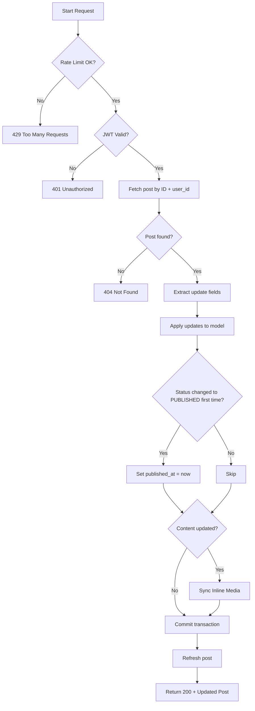

# Flow: Update Post (By ID)

**Endpoint:** `PUT /api/v1/posts/{id}`
**Summary:** Updates an existing post owned by the authenticated user. Supports partial updates, allows changing the slug, and automatically sets `published_at` when the post is published for the first time.

---

## 1. Inputs & Dependencies

| Name         | Type            | Description                                 |
| -----------  | --------------- | ------------------------------------------- |
| `post_update`| `PostUpdate`    | Partial update payload (fields optional).   |
| `id`         | `str`           | Unique ID identifying the post (path param).|
| `auth_cxt`   | `AuthContext`   | Authenticated user context (JWT validated). |
| `db`         | `AsyncSession`  | Database session dependency.                |
| `rate_limit` | `RateLimitDep`  | Rate limiter (15 requests per 1 minute).    |

---

## 2. Linear Logic (Code Flow)

1. **Rate limit check**

   * Apply composite limiter: `limit=15`, `window=60s`.
   * If exceeded → **RAISE** `429 Too Many Requests`.

2. **Authentication guard**

   * Validate JWT access token.
   * If invalid/missing → **RAISE** `401 Unauthorized`.

3. **Fetch post**

   * Query post by:

     * `id`
     * `user_id == current_user.id`

   * If not found → **RAISE** `404 Not Found`.

4. **Extract update data**

   * Convert `post_update` to dict using:

     * `exclude_unset=True`

5. **Apply field updates**

   * For each field in update data (including optional `slug`):

     * Set attribute on post model.

6. **Special publish logic**

   * If:
     * status new value == `PUBLISHED`
     * `published_at` is `NULL`

   * Then set `published_at = now()`

7. **Sync inline media (Conditional)**

   * If `content` was updated:
     * Call `PostService.sync_post_media`.
     * Deactivate old `MediaUsage` records.
     * Create new `MediaUsage` records for new/changed blocks.
     * Mark used `Media` records as `ACTIVE`.

8. **Persist changes to DB**

9. **Return response**

   * **200 OK**
   * Body: `PostResponse` (full updated post)

---

## 3. Security & Data Integrity Rules

| Rule               | Behavior                                 |
| ------------------ | ---------------------------------------- |
| Ownership enforced | Users can only update their own posts    |
| Partial updates    | Only provided fields are modified        |
| Publish timestamp  | Set once, only on first publish          |
| Rate limited       | 15 requests/min per user + IP            |
| Slug mutable       | Slug can be modified for SEO updates     |
| Media integrity    | Inline media usages are tracked and kept in sync |

---

## 4. Logic Flow

---

## 5. Response Codes

| Code    | Reason                                   |
| ------- | ---------------------------------------- |
| **200** | Post successfully updated.               |
| **401** | Invalid or missing authentication token. |
| **404** | Post not found or not owned by user.     |
| **429** | Rate limit exceeded.                     |

---
