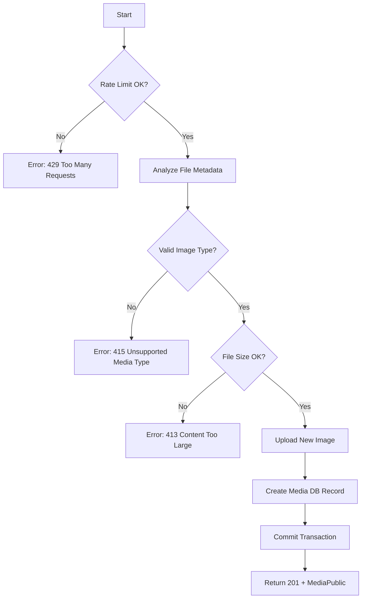

# Flow: Upload Inline Image

**Endpoint:** `POST /api/v1/posts/{id}/images`
**Summary:** Uploads an inline image for a specific post. Validates post existence and user access, validates file integrity and type, stores the file in a post-specific subdirectory, creates a media record, and returns a public URL.

---

## 1. Inputs & Dependencies

| Name            | Type           | Description                                                                                               |
| --------------- | -------------- | --------------------------------------------------------------------------------------------------------- |
| `id`            | `str`          | The unique ID of the post.                                                                                |
| `analyzed_file` | `AnalyzedFile` | Dependency that inspects magic bytes, calculates real size, normalizes extension, and resets file cursor. |
| `auth_cxt`      | `AuthContext`  | Injected authenticated user via `auth_guard`.                                                             |
| `db`            | `AsyncSession` | Database session.                                                                                         |
| `_`             | `RateLimitDep` | Rate limit (10 requests per minute).                                                                      |

---

## 2. Linear Logic (Code Flow)

1. **Rate limit check**
   - If exceeded → **RAISE** `429 Too Many Requests`.

2. **Verify Post existence**
   - Call `PostService.get_post_by_id(id)`.
   - If post not found or user doesn't own it → **RAISE** `404 Not Found` (via `PostService`).

3. **File metadata analysis (automatic via dependency)**
   - Calculate real file size.
   - Detect real MIME type using magic numbers (ignores client header).
   - Normalize file extension based on actual MIME type.
   - Reset file pointer.

4. **Validate file for image usage**
   - Allowed types:
     - `image/jpeg`
     - `image/png`
     - `image/webp`

   - If MIME type not allowed →
     **RAISE** `415 Unsupported Media Type`
     Code: `ERR_INVALID_FILE_TYPE`

   - If file size exceeds `5MB` →
     **RAISE** `413 Content Too Large`
     Code: `ERR_TOO_LARGE_FILE`

5. **Initialize `MediaService`**
   - Inject database session.

6. **Upload image**
   - Generate unique filename:
     - Slugify original name.
     - Prefix with short UUID.

   - Build structured storage directory using `StaticDirs.Uploads.POSTS` and post `id`:

     ```python
     uploads/posts/{post_id}/filename
     ```

   - Call storage backend:
     - Local filesystem (dev)
     - S3 (prod)

   - Create new `Media` DB record (not committed yet).

7. **Commit transaction**
   - Persist new media record.
   - Refresh media instance.

8. **Return updated record**
   - **201 Created**
   - Response model: `MediaPublic`

---

## 3. Storage Behavior

| Environment | Storage Backend                                       |
| ----------- | ----------------------------------------------------- |
| Development | Local filesystem (`/retainly/media` via volume mount) |
| Production  | S3 bucket (served via CDN)                            |

Storage backend is resolved via:

```python
get_storage_backend()
```

---

## 4. Inline Image Upload Rules

| Scenario                        | Action                                                                      |
| ------------------------------- | --------------------------------------------------------------------------- |
| Valid image file                | Upload image and create media record                                        |
| Invalid MIME type               | Reject with 415 (`ERR_INVALID_FILE_TYPE`)                                   |
| File too large                  | Reject with 413 (`ERR_TOO_LARGE_FILE`)                                      |

---

## 5. Logic Flow



---

## 6. Response Codes

| Code    | Reason                                                  |
| ------- | ------------------------------------------------------- |
| **201** | Image successfully uploaded and record created.         |
| **401** | Unauthorized (authentication required).                 |
| **413** | File size exceeds allowed limit (`ERR_TOO_LARGE_FILE`). |
| **415** | Invalid file type (`ERR_INVALID_FILE_TYPE`).            |
| **429** | Rate limit exceeded.                                    |

---

## 7. Security & Integrity Guarantees

- MIME type validated via magic number inspection (not client header).
- File extension normalized to match actual content.
- Unique filename generation prevents collisions.
- Storage backend abstraction (local/S3 interchangeable).
- Explicit 413 and 415 status codes ensure proper HTTP semantics.
