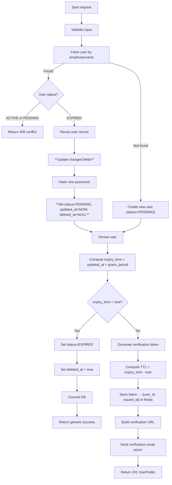

# Flow: Create User / Account Registration

**Endpoint:** `POST /api/v1/users/`
**Summary:** Creates a new user account (or reuses an expired one) and sends an email verification link.

## 1. Inputs & Dependencies

| Name      | Type                       | Description                                               |
| :-------- | :-----------------------   | :-------------------------------------------------------- |
| `user_in` | JSON Body (`UserCreate`)   | User registration data (email, username, password, etc.). |
| `db`      | Dependency (`AsyncSession`)| Database session dependency.                              |
| `_`       | RateLimitDep               | limit=5, minutes=60                                       |

## 2. Linear Logic (Code Flow)

1. **Validate input**

   * Schema validation (`UserCreate`).
   * Basic format checks (email / username / password).

2. **Check existing user**

   * Query by email or username.

3. **Handle existing user by status**

   * If `status == ACTIVE` or `status == PENDING` → raise **409 Conflict** (email/username already taken).
   * If `status == EXPIRED`:

     * Reuse the same record.
     * Update only changed fields (username, first name, last name, email if applicable).
     * Hash and replace password.
     * Set:

       * `status = PENDING`
       * `updated_at = now` (start of new grace period for email verification)
       * `deleted_at = NULL`
     * Commit and continue.
   * If no user exists → create new user with:

     * `status = PENDING`
     * hashed password.

4. **Generate verification link**

   * Compute `expiry_time = user.updated_at + grace_period`.
   * If `expiry_time < now`:

     * Set:

       * `status = EXPIRED`
       * `deleted_at = now`
     * Commit.
     * Return generic success message.
   * Else:

     * Generate secure token.
     * Compute TTL = `expiry_time - now` (seconds).
     * Store in Redis:
       `token → { user_id, issued_at }` with TTL.
     * Build verification URL.

5. **Send verification email**

   * Enqueue background task with email + verification link.

6. **Return response**

   * `201 Created` with `UserPublic` schema.

## 3. Logic flow

## 4. Response Codes

| Code    | Reason                                                        |
| :------ | :------------------------------------------------------------ |
| **201** | User created/reused successfully and verification email sent. |
| **400** | Invalid input data.                                           |
| **409** | Email or username already exists (ACTIVE or PENDING).         |
| **500** | Internal server error.                                        |
