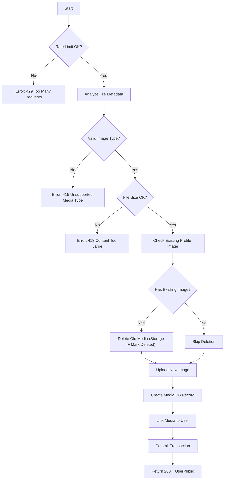

# Flow: Update User Profile Image

**Endpoint:** `PUT /api/v1/users/profile-image`
**Summary:** Uploads and replaces the authenticated user’s profile image. Validates file integrity and type, deletes previous image (if any), stores new file via storage backend, and updates the user-media relationship.

---

## 1. Inputs & Dependencies

| Name            | Type         | Description                                                                                                     |
| --------------- | ------------ | --------------------------------------------------------------------------------------------------------------- |
| `analyzed_file` | AnalyzedFile | Dependency that reads magic bytes, calculates real file size, normalizes extension, and resets the file cursor. |
| `auth_cxt`      | AuthContext  | Injected authenticated user via `auth_guard`.                                                                   |
| `db`            | AsyncSession | Database session.                                                                                               |
| `_`             | RateLimitDep | Rate limit (5 requests per minute).                                                                             |

---

## 2. Linear Logic (Code Flow)

1. **Rate limit check**
   - If exceeded → **RAISE** `429 Too Many Requests`.

2. **File metadata analysis (automatic via dependency)**
   - Calculate real file size.
   - Detect real MIME type using magic numbers (not client header).
   - Normalize extension to match actual MIME type.
   - Reset file pointer.

3. **Validate file for image usage**
   - Allowed types:
     - `image/jpeg`
     - `image/png`
     - `image/webp`

   - If MIME type not allowed →
     **RAISE** `415 Unsupported Media Type`
     Code: `ERR_INVALID_FILE_TYPE`

   - If file size exceeds `PFP_MAX_MB` →
     **RAISE** `413 Content Too Large`
     Code: `ERR_TOO_LARGE_FILE`

4. **Initialize `UserService`**
   - Inject database session.

5. **If user already has a profile image**
   - Call `MediaService.delete_media(old_media)`:
     - Delete file from storage backend.
     - Mark media record as `DELETED`.

6. **Upload new image**
   - Generate unique filename:
     - Slugify original name.
     - Prefix with short UUID.

   - Generate structured storage path:
     - `directory/YYYYMMDD/filename`

   - Call storage backend:
     - Local filesystem (dev)
     - S3 (prod)

   - Create new `Media` DB record (not committed yet).

7. **Link new media to user**
   - Assign `user.profile_image = new_media`.

8. **Commit transaction**
   - Save new media record.
   - Persist relationship update.
   - Refresh user instance.

9. **Return updated user**
   - **200 OK**
   - Response model: `UserPublic`
   - Nested `profile_image` serialized via `MediaPublic`.

---

## 3. Storage Behavior

| Environment | Storage Backend                                       |
| ----------- | ----------------------------------------------------- |
| Development | Local filesystem (`/retainly/media` via volume mount) |
| Production  | S3 bucket (served via CDN)                            |

Storage backend is resolved via:

```python
get_storage_backend()
```

Application logic remains unchanged between environments.

---

## 4. Media Replacement Rules

| Scenario               | Action                                                                      |
| ---------------------- | --------------------------------------------------------------------------- |
| No existing image      | Upload and link new media                                                   |
| Existing image present | Delete old file from storage, mark old media as `DELETED`, upload new image |
| Upload fails           | Transaction does not commit                                                 |
| Invalid MIME type      | Reject with 415                                                             |
| File too large         | Reject with 413                                                             |

---

## 5. Logic Flow



---

## 6. Response Codes

| Code    | Reason                                                  |
| ------- | ------------------------------------------------------- |
| **200** | Profile image successfully updated.                     |
| **401** | Unauthorized (authentication required).                 |
| **413** | File size exceeds allowed limit (`ERR_TOO_LARGE_FILE`). |
| **415** | Invalid file type (`ERR_INVALID_FILE_TYPE`).            |
| **429** | Rate limit exceeded.                                    |

---

## 7. Security & Integrity Guarantees

- MIME type validated via **magic number inspection**, not client-provided header.
- File extension normalized to match actual content.
- Old files removed to prevent orphaned storage.
- Unique filename generation prevents collisions.
- Storage backend abstraction (local/S3 interchangeable).
- Explicit 413 and 415 responses improve API correctness and HTTP compliance.
