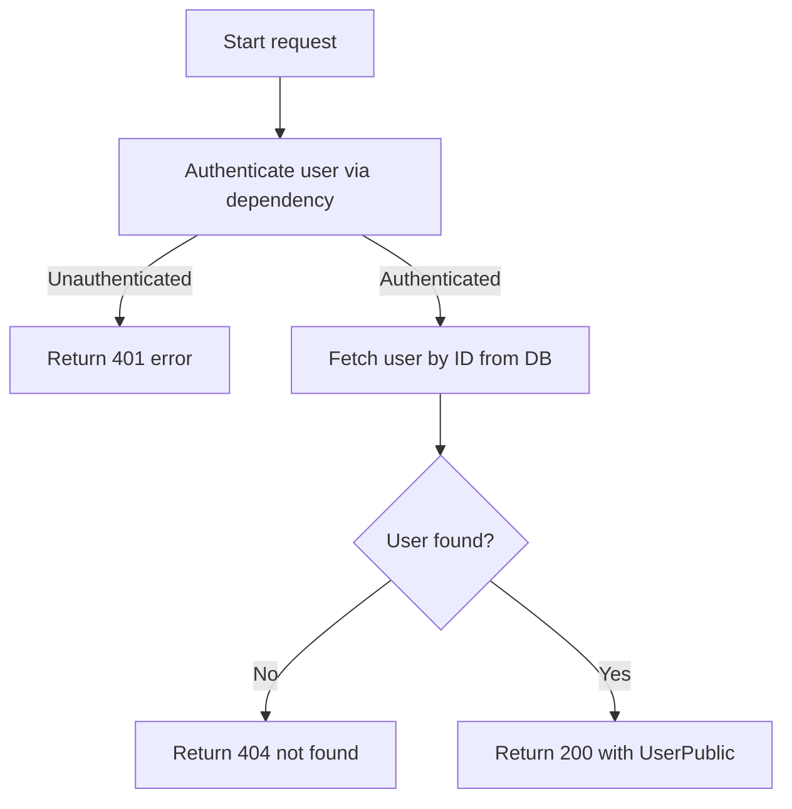

# Flow: Get Current User Details

**Endpoint:** `GET /api/v1/users/`
**Summary:** Returns the profile details of the currently authenticated user.

## 1. Inputs & Dependencies

| Name       | Type                            | Description                                    |
| :--------- | :------------------------------ | :--------------------------------------------- |
| `auth_cxt` | Dependency (`AuthContext`)      | Authenticated context (contains `user`).       |
| `db`       | Dependency (`AsyncSession`)     | Database session dependency.                   |
| `_`        | RateLimitDep                    | limit=60, minutes=1                            |

## 2. Linear Logic (Code Flow)

1. **Authenticate request**

   * Resolve `current_user` using `get_current_user` dependency.
   * If authentication fails → request is rejected before entering route logic.

2. **Fetch user from database**

   * Call `get_user_by_id(db, current_user.id)`.

3. **Handle missing user**

   * If no user is found → raise `404 NOT_FOUND` with `user_id` in error context.

4. **Return response**

   * Return user data as `UserPublic` schema.

## 3. Logic flow

## 4. Response Codes

| Code    | Reason                                        |
| :------ | :-------------------------------------------- |
| **200** | User details returned successfully.           |
| **401** | Not authenticated / invalid token.            |
| **404** | User not found in database.                   |
