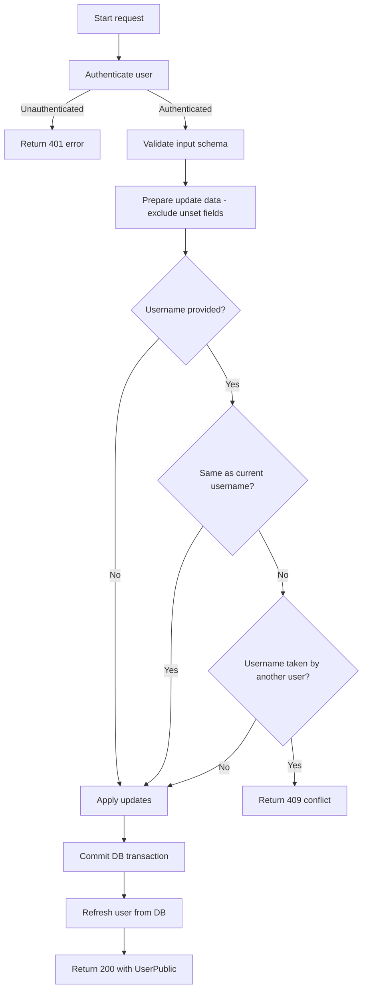

# Flow: Update Basic User Details

**Endpoint:** `PUT /api/v1/users/`
**Summary:** Updates basic user fields such as username, first name, and last name for the currently authenticated user.

## 1. Inputs & Dependencies

| Name          | Type                       | Description                                                                       |
| :------------ | :------------------------- | :-------------------------------------------------------------------------------- |
| `update_data` | JSON Body (`UserUpdate`)   | Fields to update: `username`, `first_name`, `last_name` (with schema validation). |
| `auth_cxt`    | Dependency (`AuthContext`) | Authenticated context (contains `user`).                                          |
| `db`          | Dependency (`AsyncSession`)| Database session dependency.                                                      |
| `_`           | RateLimitDep               | limit=10, minutes=1                                                               |

## 2. Linear Logic (Code Flow)

1. **Authenticate request**

   * Resolve `current_user` using `get_current_user` dependency.

2. **Validate input**

   * Pydantic `UserUpdate` schema validates username, first name, and last name formats.

3. **Prepare update data**

   * Convert schema to dictionary with `exclude_unset=True` to avoid overwriting fields with `None`.

4. **Username handling (if provided)**

   * If the new username equals the current username → ignore it (no DB query).
   * Else, check if the username is already taken by another user.
   * If taken → raise `409 CONFLICT` (`TAKEN_USERNAME_EMAIL`).

5. **Apply updates**

   * Set each provided field on `current_user`.

6. **Persist changes**

   * Commit transaction.
   * Refresh user from DB.

7. **Return response**

   * Return updated user as `UserPublic` schema.

## 3. Logic flow

## 4. Response Codes

| Code    | Reason                                          |
| :------ | :---------------------------------------------- |
| **200** | User details updated successfully.              |
| **400** | Invalid input data (schema validation failure). |
| **401** | Not authenticated / invalid token.              |
| **409** | Username already taken.                         |
| **500** | Internal server error.                          |
